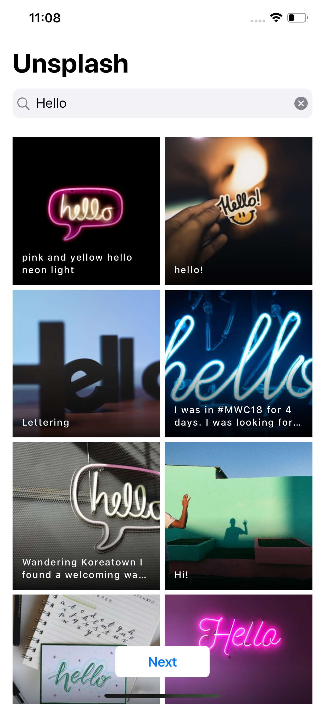

# Lumpia

Unsplash image viewer. Playground for testing SwiftUI and Redux.
 
<!-- // -->



## How to use
Get an API Key from [unsplash.com](https://unsplash.com/developers) and paste it in the file SceneDelegate.swift and start the app.

```
    // Place your key here without 'Client-ID'
    let apiKey = "YOUR_UNSPLASH_API_KEY"
    let unsplash = UnsplashService(baseURL: baseURL, apiKey: apiKey)

```
## Info
- Created with XCode 11.4.1 
- Swift 5.2
- Requires iOS 13.4
- Available for iPhone & iPad